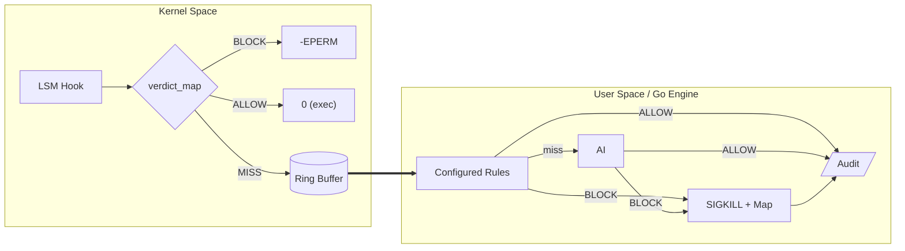

# ZASK — Zero-trust AI-Secured Kernel

Autonomous Linux Kernel Hardening via eBPF LSM and AI.

**ZASK (Zero-trust AI-Secured Kernel)** is an autonomous security engine that evaluates and blocks Linux processes using raw eBPF LSM telemetry, a deterministic engine, and a semantic AI-based judgement.

Most security tools detect threats syntactically — matching signatures, hashes, or known-bad patterns. ZASK asks a different question: can Linux kernel-level security enforcement be made semantic? [This is that attempt](./docs/03-architecture/motivation.md).

> ⚠️ ZASK is still experimental, not yet a production-ready EDR. The Machine Learning tier is planned but not yet implemented. Impact on performance must be better analized. Feedback on the architecture, threat model, or approach is very welcome — open an issue or reach out directly.

## Quick Links

- **[Setup & Installation](./docs/01-setup/README.md)**
- **[Configuration Guide](./docs/02-configuration/README.md)**
- **[Architecture & Design](./docs/03-architecture/README.md)**
- **[Development](./docs/04-development/README.md)**

## Core Capabilities

Another Linux security tool? 

- Read [Why ZASK exists?](./docs/03-architecture/motivation.md) for the motivation behind this project and comparison with existing tools.

- Read [design principles & capabilities](./docs/03-architecture/core-capabilities.md) for the main planned features.

## How It Works

Simplified overview:

ZASK operates a multi-tiered enforcement model inspired by [Daniel Kahneman's Thinking, *Fast and Slow*](https://en.wikipedia.org/wiki/Thinking,_Fast_and_Slow), System 1 (fast, intuitive) and System 2 (slow, deliberative, logical). 

- **1. LSM Hooks:** The kernel provides the raw behavioral facts (syscall sequences, arguments, and [IMA](https://sourceforge.net/p/linux-ima/wiki/Home/)-based file hashes) through eBPF LSM hooks.
- **2. Configured Rules:** A Go engine evaluates known bad patterns and enforces simple rules with minimal latency. When a process matches a determinisitc policy rule, described using `Common Expression Language (CEL)`, it is blocked/allowed immediately without further analysis. If no matches, the event can be escalated to the AI tiers.
- **3. The Fast Path (System 1 - ML) [planned]:** Event is evaluated by a discriminative model (ONNX-based), using traditional Machine Learning. Clasifies threats are handled in milliseconds. Alternative approach could be to use a BERT-based model for semantic classification, but latency would likely be higher. This tier is meant to catch similar patterns that the rule engine misses.
- **4. The Deep Arbiter (System 2 - LLM):** When the the fast model confidence falls into the "gray zone," ZASK escalates the case to the LLM. The LLM acts as a judge and performs semantic reasoning to issue a final verdict (Block vs. Allow).
- **5. The Alerting:** Asynchronously, ZASK can be configured to emit events for all executions, regardless of verdict, to a variety of outputs (JSON, Parquet, text) for security information and event management (SIEM).

| Tier | Layer | Mechanism | Latency | Purpose |
|------|-------|-----------|---------|---------|
| **1** | Kernel | eBPF LSM + IMA Hash Map | < 1μs | Instant blocking based on known bad content hashes |
| **2** | User-space | Configured Rules | < 10ms | CEL policy matching |
| **3** | User-space | Fast Classifier | < 50ms | Local machine learning model triage |
| **4** | User-space/remote | LLM Semantic Judge | 5-10s | Gen AI reasoning on process intent for ambiguous cases |

## Development

> **Warning:** ZASK interacts directly with the Linux kernel via eBPF LSM hooks. A bug or misconfiguration could cause serious system instability. For development, the recommended approach is to use a dedicated Linux VM. 

The maintainer development environment is macOS + [Lima based](https://lima-vm.io/) VM. Compiling and running the deamon must be done inside Linux. All `vm-*` targets use `limactl shell` (from the macOS host). 

This is a short summary of the most common commands:

| Command | Where | What |
|---------|-------|------|
| `make generate` | Linux | Compile eBPF C → Go bindings via `bpf2go` |
| `sudo ./zaskd` | Linux | Load eBPF programs into the kernel |
| `make build` | Both | Compile the `zaskd` Go binary |
| `make lint` | Both | Run `golangci-lint` |
| `make test` | Both | Run `go test ./...` |
| `make vm-build` | macOS | Copy → generate eBPF → build → sync back |
| `make vm-run` | macOS | Start the daemon inside the VM |
| `make vm-test` | macOS | Run kernel-level integration tests |

See the full [Lima Development Guide](./docs/04-development/lima-dev-guide.md) for VM setup, VS Code Remote-SSH, and troubleshooting.

## Documentation

The documentation is split in the following sections:
- The [setup section](./docs/01-setup/README.md) covers the Linux kernel requirements, environment checks, and installation instructions to get ZASK up and running.
- The [configuration section](./docs/02-configuration/README.md) details the configuration options for ZASK, including general settings, deterministic rules, AI integration, and observability features. 
- The [architecture section](./docs/03-architecture/README.md) dives into the internal design and implementation details of ZASK.
- The [development section](./docs/04-development/README.md) provides instructions for setting up a development environment, building the project, and running tests.

### Roadmap

| Feature | Purpose | 
|---------|---------|
| Unified observability config | Merge `audit` + `logging` under a single `observability` section |
| Lattency benchmarks | Measure and optimize latency for each tier to validate architectural decisions |
| Prometheus `/metrics` | Queue depth, circuit breaker state, verdict counters |
| Default action config | Configurable fallback action (`AI_QUEUE` / `ALLOW`) when no rule matches |
| Parquet columnar export | Efficient storage and analytics for audit events |
| Helm chart | One-command DaemonSet deployment on Kubernetes |
| ONNX local inference tier | Sub-50ms ML classification for common patterns |

## License and Contributing

ZASK is open-source software licensed under Apache 2.0 License.

Contributions and ideas are welcome! 
